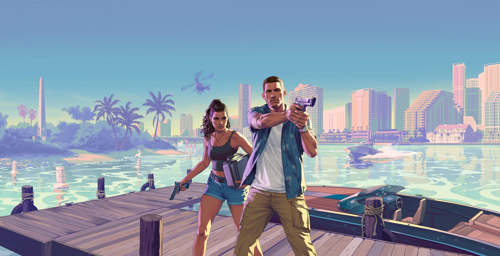

<div align="center">



# 🌴 GTA VI Cinematic Landing Page

[](https://react.dev/)
[](https://vitejs.dev/)
[](https://tailwindcss.com/)
[](https://greensock.com/gsap/)

**A high-performance, cinematic recreation of the Grand Theft Auto VI promotional aesthetic.**  
*Experience the vibe of Vice City through modern web animations and immersive storytelling.*

[Live Demo](#) • [Features](#-key-features) • [Installation](#-getting-started) • [Tech Stack](#-the-arsenal)

</div>

---

## 🎭 The Experience

This project is a meticulously crafted front-end tribute to Rockstar Games' upcoming masterpiece, **GTA VI**. It focuses on delivering a "cinematic-first" user experience, utilizing the power of **GSAP** for complex scroll-triggered animations and **Tailwind CSS** for a responsive, pixel-perfect layout.

### 🎬 What Makes It Tick?
- **Immersive Narrative**: A scroll-driven storytelling approach that guides the user through the world of Lucia and Jason.
- **Visual Fidelity**: High-resolution media assets optimized for the web with lazy loading and smart caching.
- **Dynamic Masking**: Custom SVG mask transitions that reveal content in a stylized, "GTA-esque" manner.

---

## ✨ Key Features

| Feature | Description |
| :--- | :--- |
| **🎥 Cinematic Hero** | Interactive video sequence with dynamic typography overlays. |
| **🖱️ Scroll-Driven Animations** | Powered by GSAP ScrollTrigger for smooth, parallax-rich transitions. |
| **📱 Responsive Design** | Tailored experiences for Mobile, Tablet, and Ultra-Wide Desktop screens. |
| **👤 Character Spotlights** | Stylized profile sections for the main protagonists (Lucia & Jason). |
| **🎞️ Multi-Layered Vidéos** | Seamless transitions between high-quality gameplay and cinematic clips. |
| **⚡ Ultra-Fast Build** | Built on Vite for near-instant hot module replacement and optimized production builds. |

---

## 🛠️ The Arsenal

- **Core**: [React 19](https://reactjs.org/) (Functional Components, Hooks)
- **Styling**: [Tailwind CSS 4](https://tailwindcss.com/) (Utility-first CSS)
- **Animation**: [GSAP](https://greensock.com/gsap/) (ScrollTrigger, Timeline)
- **Responsiveness**: [React Responsive](https://github.com/yocontra/react-responsive) (Media Queries)
- **Icons**: [Lucide React](https://lucide.dev/) (Modern & Vectorized)
- **Build Tool**: [Vite](https://vitejs.dev/) (The next-gen frontend tool)

---

## 📂 Project Blueprint

```text
GTA_6-landingPage/
├── 📁 public/            # High-res videos & static assets
├── 📁 src/
│   ├── 📁 constants/     # Configuration & Responsive settings
│   ├── 📁 sections/      # Functional page modules
│   │   ├── NavBar.jsx
│   │   ├── Hero.jsx
│   │   ├── FirstVideo.jsx
│   │   ├── Lucia/Jason.jsx
│   │   └── ...
│   ├── App.jsx           # Main layout orchestrator
│   ├── index.css         # Global styles & Tailwind directives
│   └── main.jsx          # Entry point
├── tailwind.config.js    # Styling configuration
└── vite.config.js        # Build pipeline setup
```

---

## 🚀 Getting Started

To get the project running locally, follow these simple steps:

1. **Clone the repository**
   ```bash
   git clone https://github.com/your-username/GTA_6-landingPage.git
   ```

2. **Install dependencies**
   ```bash
   npm install
   ```

3. **Ignite the engine**
   ```bash
   npm run dev
   ```

4. **Navigate to Vice City**
   Open `http://localhost:5173` in your browser.

---


---

## ⚖️ Disclaimer

*This project is a fan-made creation and is not affiliated with, authorized, or endorsed by Rockstar Games or Take-Two Interactive. All trademarks and registered trademarks are the property of their respective owners.*

---

<div align="center">

**Made with 🔥 and ✨ by [Aman Shukla](https://github.com/amanshukla2004)**

</div>
